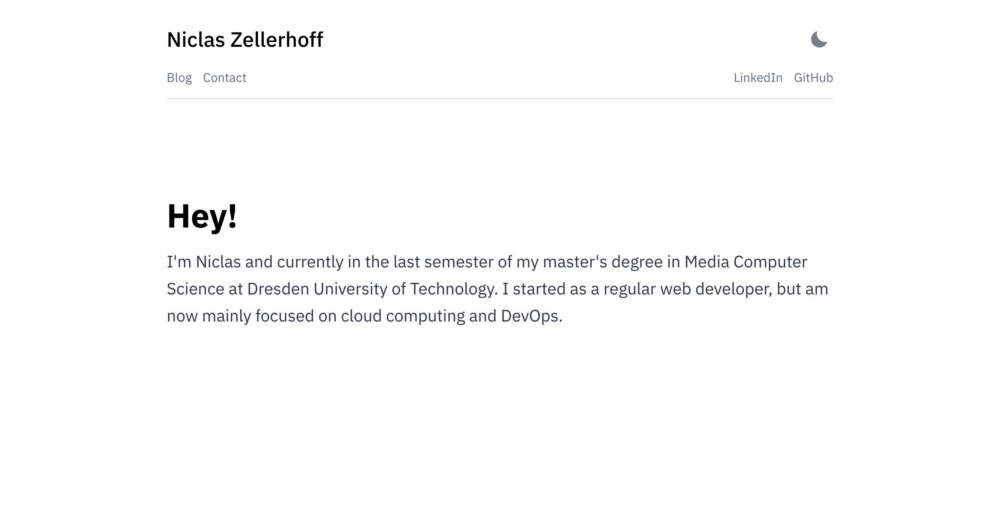

A few weeks ago, I happened to come across a Reddit post about [Forrest Brazeal's Cloud Resume Challenge](https://cloudresumechallenge.dev/). It was originally intended to help newbies (like me) get some exposure in the cloud industry by sharing completed resumes with his professional network and also helping them by providing code reviews. However, since this offer ended shortly after it began in summer 2020, for me personally it mainly serves as a challenge and to test my AWS knowledge. The goal was to deploy a simple, self-designed HTML-based resume using AWS technologies while getting in touch with as many services as possible, hence deliberately over-engineering it, in contrast to simple (almost) 1-click solutions like Netlify. The result was this website, if you want to take a look at the code, feel free to check out my [GitHub](https://github.com/niclaszll/niclaszll.de).



## Step 1: Become certified in AWS

Luckily, I had already completed my [Cloud Practitioner](https://www.credly.com/badges/dcdc98f7-3ed1-44be-9668-731eff198ca4/linked_in_profile) and [Developer Associate](https://www.credly.com/badges/f236b7b7-a2ca-47eb-b1df-ad0088222b32/public_url) certification a few months earlier. I can only recommend anyone starting out in the cloud sector to at least tackle one certificate, simply to understand the basics (and since it makes your resume look a little nicer). Of course, you don't necessarily have to take the exam, what is more important: **get your hands dirty**, for example, by giving the Cloud Resume Challenge a shot as well.

## Step 2: Create a resume website

The task is to build a resume from some HTML and CSS. But since I've worked enough with HTML and CSS by now and I don't want to spend hours in design perfectionism, I just decided to use [Gatsby](https://github.com/gatsbyjs/gatsby) and a simple [template from LekoArts](https://github.com/LekoArts/gatsby-starter-minimal-blog). The result is less a resume (I prefer to use LinkedIn for that) and rather a small blog. I would suggest you to start off with a simple HTML page without much styling or frontend framework and to pick up this step again at the end. Otherwise you'll quickly get lost in CSS subtleties, whereas this challenge is supposed to be more about gaining cloud experience.

One piece I added is a simple Docker setup to avoid having to install gatsby globally, among other things. Instead, the [Visual Studio Code Remote - Containers](https://code.visualstudio.com/docs/remote/containers) extension allows me to use a full-featured development environment directly inside a container to create the frontend.

## Step 3: Deploy it to S3

The next step is to deploy the resulting website to S3 to let the public admire it. Initially, this means just uploading the public folder of my Gatsby setup to the S3 bucket and configuring it to host a static website. As is almost always the case, you can find all the necessary information in the [AWS documentation](https://docs.aws.amazon.com/AmazonS3/latest/userguide/WebsiteHosting.html). Access is not realized directly via S3, but rather through a cloudfront distribution, which enables caching and also makes it possible to use a custom domain.

## Step 4: Count your visitors

So far, only a static website has been deployed but we haven't really dived into cloud specific services yet. In order to actually include a few services where the cloud excels, we will also add a visitor counter. The concept is quite simple: Each time the website is requested, an API call is made to an API gateway, which in turn maps to a lambda function. This lambda function does nothing else than incrementing a field in a DynamoDB table. The new counter is returned and displayed on the web page. To show some code as well, here is the simple Python Lambda function:

```python
import boto3
import json
import decimal

# solution to serialize decimal in json from https://stackoverflow.com/a/3885198/7295614
class DecimalEncoder(json.JSONEncoder):
    def default(self, o):
        if isinstance(o, decimal.Decimal):
            return str(o)
        return super(DecimalEncoder, self).default(o)

# get dynamodb table reference
table = boto3.resource('dynamodb').Table('ResumeCounterTable')

def lambda_handler(event, context):

    # increment visitor count and return new value
    response = table.update_item(
        Key={'resource': 'website'},
        ExpressionAttributeValues={':inc': decimal.Decimal(1)},
        UpdateExpression="ADD visitor_count :inc",
        ReturnValues="UPDATED_NEW"
    )
    
    return {
        "statusCode": 200,
        "headers": {
            "Access-Control-Allow-Headers": "Content-Type",
            "Access-Control-Allow-Origin": "https://niclaszll.de"
        },
        "body": json.dumps(response['Attributes']['visitor_count'], indent=4, cls=DecimalEncoder)
    }
```

## Step 5: Provision infrastructure as code

Even though the backend is relatively simple and can be assembled in a few minutes in the AWS Console, it's still not the most convenient way, especially if you need to update or delete something. Fortunately, AWS has our back and offers the ability to provision our cloud infrastructure in a number of ways. In this case, we use AWS Serverless Application Model (SAM), an Infrastructure as Code (IaC) solution that allows us to define and build our serverless application using a single YAML template. Among other things, this allows us to keep and update our infrastructure together with our codebase and, most importantly, to create an application infrastructure that can be reproduced over and over again. Here you can see the visitor counter API in code form:

```yaml
AWSTemplateFormatVersion: '2010-09-09'
Transform: 'AWS::Serverless-2016-10-31'
Description: Resume view counter backend

Globals:
  Function:
    Runtime: python3.8
    MemorySize: 128

Resources:
  ResumeCounterFunction:
    Type: 'AWS::Serverless::Function'
    Properties:
      FunctionName: ResumeCounterFunction
      CodeUri: ./
      Handler: handlers/app.lambda_handler
      Description: Function to count site views
      Timeout: 3
      Policies:
        - DynamoDBCrudPolicy:
            TableName: !Ref ResumeCounterTable
      Events:
        ResumeViews:
          Type: Api
          Properties:
            RestApiId: !Ref ResumeApi
            Path: /count
            Method: get

  ResumeApi:
    Type: AWS::Serverless::Api
    Properties:
      Cors:
        AllowOrigin: "'https://niclaszll.de'"
      EndpointConfiguration: Regional
      OpenApiVersion: 3.0.1
      StageName: v1

  ResumeCounterTable:
    Type: AWS::DynamoDB::Table
    Properties:
      ProvisionedThroughput:
        ReadCapacityUnits: 5
        WriteCapacityUnits: 5
      AttributeDefinitions: 
        - AttributeName: resource
          AttributeType: S
      KeySchema: 
        - AttributeName: resource
          KeyType: HASH
      TableName: ResumeCounterTable
```

Under `Resources:` you will find the three components of our API, the Lambda function, the API Gateway, and the DynamoDB database. Each component in turn contains its configuration, for example the lines

```yaml
CodeUri: ./
Handler: handlers/app.lambda_handler
```

define where to find the actual logic of the lambda function (the handler). As always, more information on the AWS SAM specification can be found in the [AWS Developer Guide](https://docs.aws.amazon.com/serverless-application-model/latest/developerguide/sam-specification.html).

## Step 6: CI/CD

Even though AWS SAM takes some of the work off our shoulders, currently updating the website still means some manual effort. AWS SAM has to be installed locally on the developer PC, the application has to be built and then deployed. At the same time, the `public/` folder has to be uploaded to S3 every time changes are made to the frontend. All this costs time and should therefore be automated. Since we have everything from application code to cloud infrastructure stored in our Git repository anyway, we can easily leverage CI/CD solutions like GitHub Actions. This allows us to define our entire deployment workflow once again in a single YAML file. This deployment workflow can then be configured to execute on each push to the master branch, updating the entire application stack without any additional intervention by us. For example, the following snippet describes the front-end deployment process.

```yaml
steps:
    - uses: actions/checkout@v2
    - name: Configure AWS Credentials
    uses: aws-actions/configure-aws-credentials@v1
    with:
        aws-access-key-id: ${{ secrets.AWS_ACCESS_KEY_ID }}
        aws-secret-access-key: ${{ secrets.AWS_SECRET_ACCESS_KEY }}
        aws-region: eu-central-1
    - uses: actions/setup-node@v1
    with:
        node-version: "14.x"
    - run: npm install
    - run: npm run build
    - name: Deploy static site to S3 bucket
    run: aws s3 sync ./public/ s3://resume-frontend-niclaszll --delete --acl public-read
    - name: Invalidate CloudFront Cache
    run: aws cloudfront create-invalidation --distribution-id ${{ secrets.AWS_CLOUDFRONT_DISTRIBUTION_ID }} --paths "/*"
```

To begin, the AWS credentials are configured for this run, retrieved from secrets defined in the GitHub repository. After that, the same steps are performed that would also be executed locally on the developer's PC: build the application with npm and push the folder to S3 via the AWS CLI. Afterwards, the CloudFront cache is invalidated so that pushed changes are displayed immediately.

## Conclusion

✨ And that's it, everything just magically works. ✨ The challenge was actually pretty fun and I even learned a few new things, especially regarding AWS SAM. 

**Disclaimer**: the Visitor Counter is disabled on this website, as I don't like to keep all the resources running constantly. However, the code including provisioning in the GitHub repository is fully functional and only needs to be extended by a simple API request in the frontend.